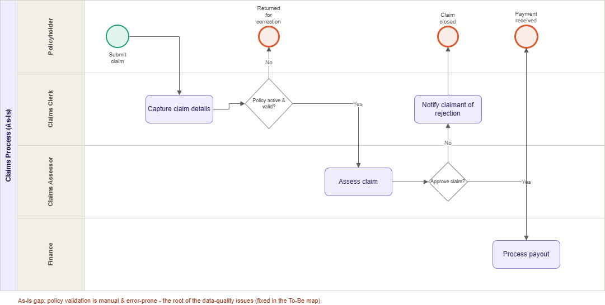
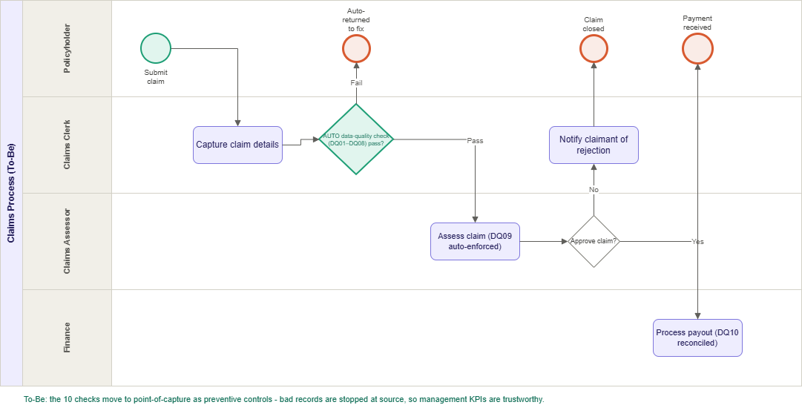

# Claims Process Analysis (As-Is → To-Be)

A business-analysis layer on top of the data-quality framework in this repo. It maps
the life-insurance claims and policy process, shows where the data-quality failures
caught by `02_data_quality_checks.sql` actually originate, and redesigns the process
so those checks run as **preventive controls at the point of capture** rather than as
a **detective scorecard** after the fact.

> The data is synthetic (see the main [README](../README.md)). This document analyses
> the *process* the data represents; it does not describe a real insurer's operations.

## Summary

Today the 10 data-quality rules (DQ01–DQ10) run *after* records exist and log failures
to `dq.results`. A typical run flags ~145 bad records across ~5,000 policies and
~139,000 premium transactions - meaning errors already reached the reporting layer
before they were found. This analysis maps each rule to the process step where the
error is introduced and proposes a To-Be process that validates at entry.

## Stakeholders

| Stakeholder | Interest in the process |
|---|---|
| Policyholder | Fast, correct claim outcome |
| Claims Clerk | Capture clean, complete claim/policy data |
| Claims Assessor | Assess valid claims against policy terms |
| Finance | Pay only reconciled, approved claims |
| Management | Trustworthy loss-ratio / lapse / persistency KPIs |

## As-Is process

Four swimlanes: Policyholder → Claims Clerk → Claims Assessor → Finance. The claim is
captured, validated **manually**, assessed, approved, and paid. Data-quality checks
run *downstream* as a scorecard, so defects are detected after they have already
flowed into the management views (`dw.vw_loss_ratio`, `dw.vw_lapse_rate`,
`dw.vw_persistency`, `dw.vw_api`).

### Findings

- **Validation is downstream/detective.** DQ01-DQ10 run against data that already
  exists, not at the moment of capture.
- **Critical defects reach reports before they are caught** - e.g. DQ03 (premium ≤ 0),
  DQ06 (duplicate `policy_id`), DQ07 (broken referential integrity), DQ09
  (`claim_amount` > `sum_assured`).
- **Management KPIs are built on unvalidated data**, so loss ratio, lapse rate and
  persistency can be reported off records that later fail a check.

## DQ rule → process control mapping

This is the core of the analysis: every existing check is really a control that
belongs at a specific step in the process.

| Rule | Dimension | Severity | What it checks | Process control point |
|---|---|---|---|---|
| DQ01 | Completeness | High | `sum_assured` populated | Policy/claim **capture** |
| DQ02 | Completeness | Medium | `gender` populated | Capture |
| DQ03 | Validity | Critical | `monthly_premium` > 0 | Capture |
| DQ04 | Validity | High | `start_date` not in future | Capture |
| DQ05 | Validity | High | Age between 18 and 90 | Capture |
| DQ06 | Uniqueness | Critical | `policy_id` unique | Capture (integrity) |
| DQ07 | Consistency | Critical | `customer_id` exists | Capture (integrity) |
| DQ08 | Consistency | Medium | Valid SA province | Capture |
| DQ09 | Accuracy | Critical | `claim_amount` ≤ `sum_assured` | **Claim assessment** |
| DQ10 | Accuracy | Medium | Paid premium = policy premium | **Premium reconciliation** |

## To-Be process

Same swimlanes, but:

- **DQ01–DQ08 become an automated control gateway at Capture.** A claim/policy that
  fails is auto-returned for correction before it enters the book - errors are
  **prevented at source**, not detected later.
- **DQ09 is enforced automatically at Assessment** - an over-claim (`claim_amount`
  > `sum_assured`) cannot be approved.
- **DQ10 runs at Finance** as a premium-reconciliation control before payout.
- **The scorecard (`dq.results`) becomes a monitoring dashboard**, not a safety net -
  it now confirms quality rather than being the first place errors are found.

### Requirements (derived)

- The system **shall** validate completeness, validity, uniqueness and referential
  integrity (DQ01-DQ08) at the point of capture and block records that fail Critical
  rules.
- The system **shall** prevent approval of any claim where `claim_amount` exceeds the
  policy `sum_assured` (DQ09).
- The system **shall** reconcile each paid premium against the policy premium (DQ10)
  before payout.
- Management reports **shall** draw only from validated records.

## Outcome

By moving the 10 checks from a downstream scorecard to preventive controls at capture
and assessment, defects are stopped at source. The loss-ratio, lapse-rate and
persistency metrics management sees are therefore trustworthy by construction, and the
existing `dq.results` scorecard shifts from error-catching to ongoing monitoring.

## Techniques & tools

Process mapping (BPMN) · Requirements analysis · Gap analysis · DAMA data-quality
dimensions · SQL Server (T-SQL) · Power BI.

## Related documents in this repo

- [Data Quality Rules Catalogue](data_quality_rules.md) - the 10 rules as documented business rules
- [Calculation Framework](calculation_framework.md) - metric definitions with change-control sign-off
- [Data Dictionary](data_dictionary.md)
